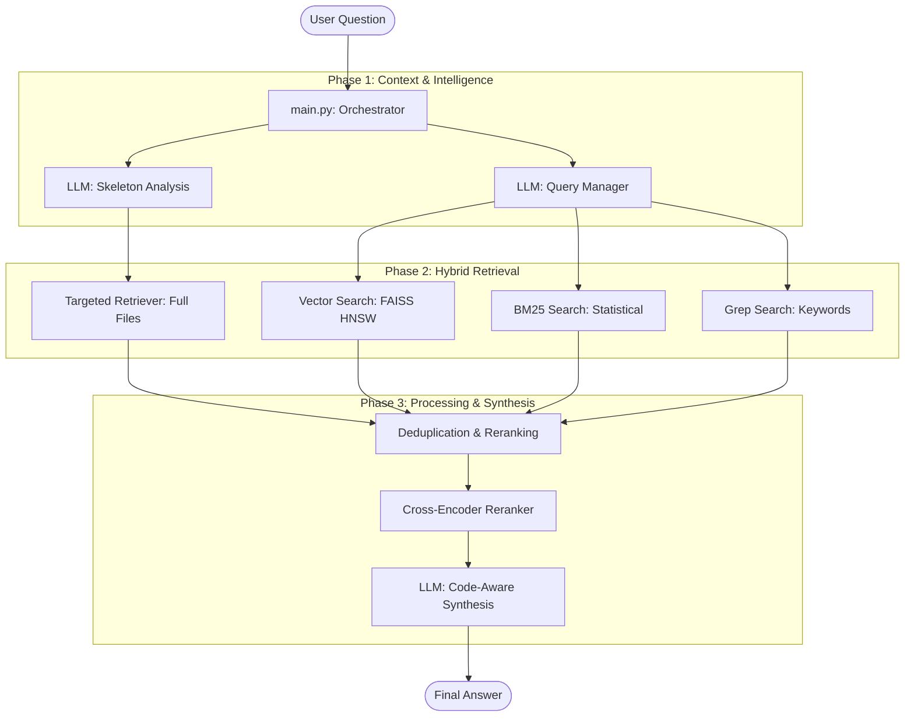

# Architecture: Agentic Search Tool

This document outlines the high-level architecture and processing pipeline of the Agentic Search Tool. The system is designed to perform context-aware, semantic code searches across large repositories by combining statistical models with LLM intelligence.

## System Architecture

The tool follows a **Modular Pipeline Architecture**, separating context acquisition, search execution, and answer synthesis.

---

## Core Components

### 1. The Orchestrator (`main.py`)
The primary entry point that manages the lifecycle of a search request. It executes a **7-Step Pipeline**:
1. **Load Skeleton**: Retrieves the project file tree.
2. **Skeleton Analysis**: Identifies critical files before searching.
3. **Targeted Retrieval**: Injects full content of critical files to prevent truncation.
4. **Code Analysis**: Builds a symbol index and call graph.
5. **Hybrid Search**: Executes Vector, BM25, and Regex searches in parallel.
6. **RRF & Reranking**: Merges results and uses a Cross-Encoder to select the top context.
7. **Synthesis**: Generates the final grounded answer.

### 2. The Intelligence Layer (`src/llm_client.py`)
The "brain" of the application. It interacts with OpenAI models to:
- **Nominate Files**: Uses `gpt-4o-mini` to guess which files contain the answer based only on the file names.
- **Generate Queries**: Translates natural language into technical search terms and regex patterns.
- **Synthesize Answers**: Combines retrieved code snippets, call graphs, and file structure to produce high-fidelity answers.

### 3. The Search Engine
The tool uses a **Triple-Hybrid Search** strategy to maximize recall:
- **Vector Search (`src/tools/vector_search_tool.py`)**: Uses `text-embedding-3-small` and FAISS (HNSW) for semantic understanding (e.g., finding "auth logic" when searching for "security").
- **BM25 Search (`src/tools/bm25_search_tool.py`)**: A statistical model that finds the most relevant code chunks based on term frequency (TF-IDF).
- **Regex Search (`src/tools/search_tool.py`)**: A high-speed `ripgrep` wrapper that finds literal matches and complex patterns.

### 4. Data & Retrieval Tools
- **Targeted Retriever (`src/tools/targeted_retriever.py`)**: Specifically designed to bypass search limitations by loading the entire content of small-to-medium files (up to 100k characters).
- **Markdown Repo Manager (`src/tools/markdown_repo_manager.py`)**: Efficiently fetches remote GitHub repositories using GraphQL batching and caches them locally as flattened Markdown.

---

## Data Flow
1. **Discovery**: The tool reads the `README.md` and file structure to understand the "big picture."
2. **Focus**: Instead of searching everything, it "targets" likely files (e.g., `config.py` for settings).
3. **Retrieval**: It gathers broad semantic matches (Vector) and exact matches (BM25/Grep).
4. **Filtering**: A **Cross-Encoder Reranker** verifies the relevance of each snippet against the actual question.
5. **Grounding**: The final LLM call is "clamped" to the provided context to prevent hallucinations.
